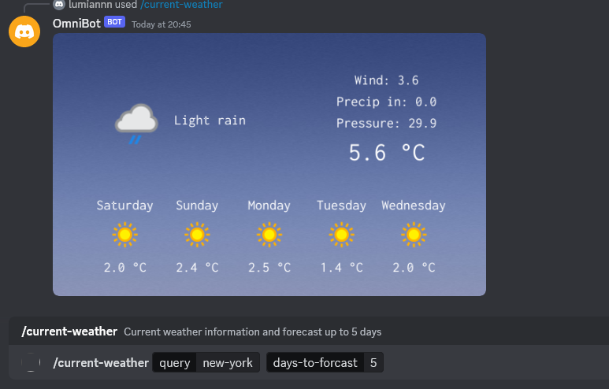

# Used libraries

- [discordgo](https://github.com/bwmarrin/discordgo)
- [imaging](https://github.com/fogleman/gg)
- [gg](https://github.com/disintegration/imaging)

# Features

- Weather Updates: On command, the bot fetches and displays current weather information for a specified location. 
  It generates image on data from [weatherapi](https://www.weatherapi.com)

# Screens



# Usage

Create .env at root directory and write your discord token to TOKEN

```
go run cmd/main.go
```
